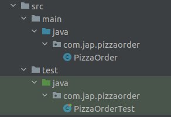
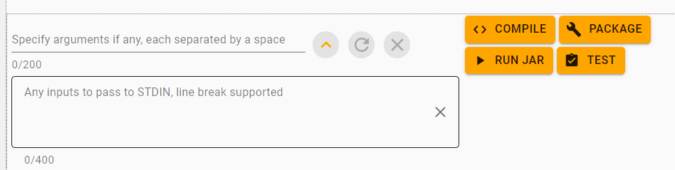

# Instructions to work on the Workbench and Submit Practices and Challenges

1. Fork the project into your own name space.

2. Navigate to the workbench **https://coding.stackroute.niit.com/**.

3. Click on Open to Code.

   

4. The project created has the maven structure as shown below. Maven is a build tool to give structure to Java Projects.

   

5. The **src** folder contains the main and test folders that have the java classes and test classes.

6. To compile the program click on the Compile button, there is no need to pass the class name as a parameter, maven automatically executes the command to compile the **.java** file present in the src folder.

   

7. Execute the test cases by clicking on the test button,there is no need to pass the class name as a parameter.

   

